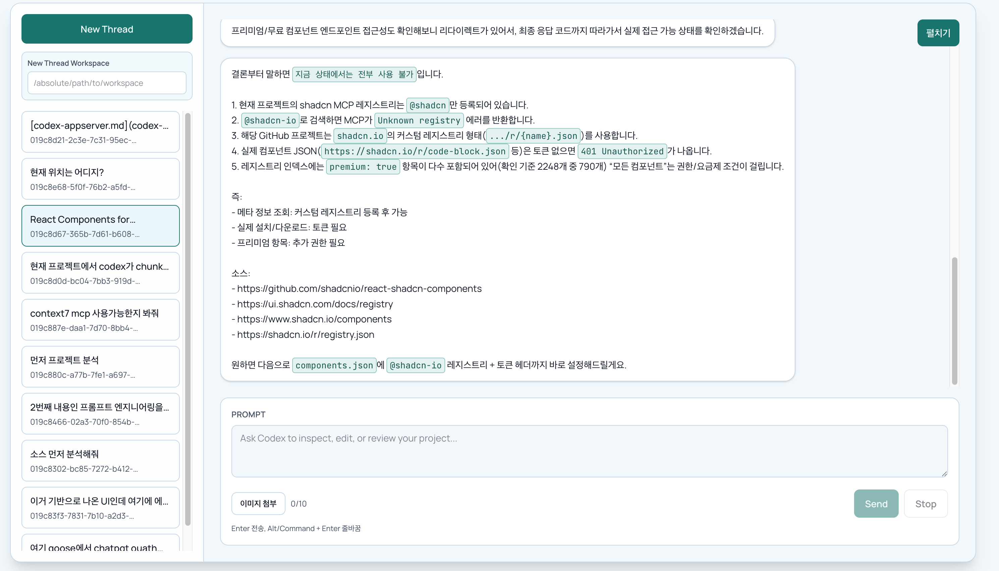

# Codex Web UI + Codex App Server

Monorepo with:

- `web-ui`: Next.js 16.1.6 chat UI
- `codex-app-server`: Fastify BFF that bridges to `codex app-server` over stdio JSON-RPC
- `packages/shared-contracts`: shared API/SSE contracts

## Preview



Study guide:

- [MONOREPO_WORKFLOW.md](./MONOREPO_WORKFLOW.md): how root-level monorepo development and dual-server runtime work
- [WEB_UI_ENHANCEMENT_CHECKLIST.md](./WEB_UI_ENHANCEMENT_CHECKLIST.md): prioritized checklist for web-ui hardening/improvements

## Requirements

- Node.js `>=20.9.0` (project pinned to `v22.22.0` in `.nvmrc`)
- pnpm `10.x`
- `codex` CLI installed and executable in PATH

## Install

```bash
pnpm install
```

## Run (No Docker)

Terminal 1:

```bash
cp codex-app-server/.env.example codex-app-server/.env
pnpm --filter codex-app-server dev
```

Terminal 2:

```bash
pnpm --filter web-ui dev
```

Open: `http://localhost:3000`

UI usage:

- Prompt 입력창의 `이미지 첨부` 버튼으로 여러 장 이미지를 선택할 수 있습니다.
- 텍스트 없이 이미지들만 보내는 것도 가능합니다.
- Assistant/User 메시지의 Markdown 코드펜스(````lang ... ````)는 문법 하이라이트 + Copy 버튼으로 표시됩니다.
- 사이드바 `New Thread Workspace` 값으로 스레드 생성 시 `cwd`를 지정할 수 있고, 현재 스레드 `Workspace`는 상단 `Thread ID` 옆에 표시됩니다.

If you open UI via `http://127.0.0.1:3000`, keep `CORS_ORIGIN` including both:

```env
CORS_ORIGIN=http://localhost:3000,http://127.0.0.1:3000
HTTP_BODY_LIMIT_MB=20
THREAD_MESSAGES_PAGE_SIZE=10
```

## Run (Docker Compose: web-ui + codex-app-server)

```bash
# optional: customize compose env
cp .env.docker.example .env

docker compose up --build
```

Open: `http://localhost:3000`

Notes:

- Both services start together:
  - `web-ui` on `3000`
  - `codex-app-server` on `4000`
- `codex` CLI is installed inside the backend container.
- Host repository is mounted into backend container at `/workspace`.
- Codex auth/session data is persisted in named volume `codex_home` (`/root/.codex` in container).
- To stop/remove containers:

```bash
docker compose down
```

## Root Scripts

```bash
pnpm dev
pnpm typecheck
pnpm test
pnpm lint
pnpm build
```

## API Surface

- `POST /v1/auth/chatgpt/start`
- `POST /v1/auth/chatgpt/cancel`
- `GET /v1/auth/state`
- `GET /v1/models`
- `POST /v1/threads`
- `POST /v1/threads/:threadId/resume`
- `GET /v1/threads`
- `GET /v1/threads/:threadId/messages?cursor=&limit=`
- `GET /v1/threads/:threadId`
- `POST /v1/threads/:threadId/turns`
- `POST /v1/threads/:threadId/turns/:turnId/steer`
- `POST /v1/threads/:threadId/turns/:turnId/interrupt`
- `POST /v1/approvals/command`
- `POST /v1/approvals/file-change`
- `GET /v1/events` (SSE)
